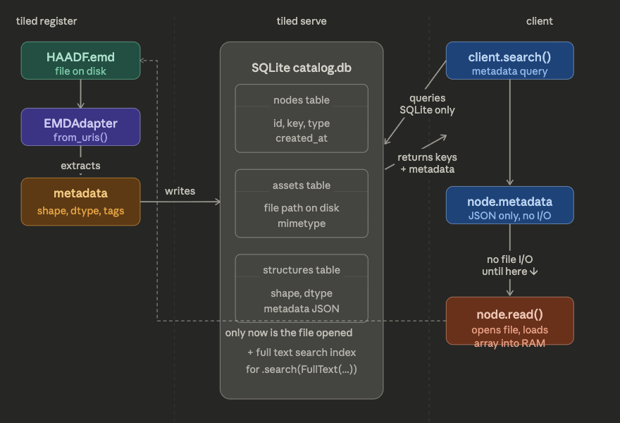

# Serving Custom Scientific Data with Tiled

A guide to serving `.emd` microscopy files over HTTP using [Tiled](https://blueskyproject.io/tiled/), with a custom HyperSpy-based adapter.

---

## What is Tiled?

Tiled is a data server that exposes scientific datasets over HTTP. You can:
- Serve files remotely and access them like a REST API
- Work with a Python client that feels like reading local files
- Register custom adapters for formats Tiled doesn't know natively

---

## Prerequisites

- Python 3.11+
- [`uv`](https://github.com/astral-sh/uv) (package manager)
- Packages: `tiled`, `hyperspy`, `exspy`

```bash
uv add tiled hyperspy exspy
```

---

## Project Structure

```
exploring-bluesky-tiled/
├── config.yml       # Tiled server configuration
├── custom.py        # Your custom adapter
├── data/            # Your .emd files go here
│   ├── HAADF.emd
│   └── SI-HAADF.emd
└── pyproject.toml
```

---

## Step 1: Write the Custom Adapter (`custom.py`)

Tiled doesn't know how to read `.emd` files out of the box. You need to write an **adapter** — a class that bridges your file format and Tiled.

Two classmethods are required:
- `from_uris` — called at **register time** (client-side, crawling files)
- `from_catalog` — called at **serve time** (server-side, reading from the database)

```python
import numpy as np
import hyperspy.api as hs
from urllib.parse import urlparse
from tiled.adapters.array import ArrayAdapter
from tiled.adapters.mapping import MapAdapter


class EMDAdapter(MapAdapter):

    @classmethod
    def from_uris(cls, data_uri, metadata=None, **kwargs):
        # data_uri comes in as e.g. "file://localhost/path/to/file.emd"
        filepath = urlparse(data_uri).path

        signals = hs.load(filepath)
        if not isinstance(signals, list):
            signals = [signals]

        children = {}
        for i, signal in enumerate(signals):
            array_data = signal.data
            file_metadata = dict(signal.metadata.as_dictionary())
            key = signal.metadata.General.title or str(i)
            children[key] = ArrayAdapter.from_array(array_data, metadata=file_metadata)

        return cls(children)

    @classmethod
    def from_catalog(cls, data_source, metadata=None, **kwargs):
        # data_source is a DataSource object with an .assets attribute
        data_uri = data_source.assets[0].data_uri
        return cls.from_uris(data_uri, metadata=metadata, **kwargs)
```

**Why `MapAdapter`?**
EMD files often contain multiple signals (HAADF, EDS, EELS etc.). `MapAdapter` exposes each as a named child. If your file always has a single array, you could use `ArrayAdapter` directly instead.

---

## Step 2: Configure the Server (`config.yml`)

```yaml
trees:
  - path: /
    tree: tiled.catalog:from_uri
    args:
      uri: sqlite:////tmp/tiled_catalog.db
      readable_storage:
        - ./data/
      adapters_by_mimetype:
        application/x-emd: custom:EMDAdapter
```

- `uri` — SQLite database where the catalog (file registry) is stored
- `readable_storage` — directories the server is allowed to read from
- `adapters_by_mimetype` — maps a mimetype to your adapter class

---

## Step 3: Initialize the Catalog Database

uv run tiled catalog init sqlite+aiosqlite:///catalog.db

---

## Step 4: Start the Server

```bash
PYTHONPATH=/path/to/your/project \
  uv run tiled serve config --public config.yml --api-key secret --host 0.0.0.0 --port 8000
```

```powershell
$env:PYTHONPATH = "C:\Users\utkarsh_dev\Documents\projects\exploring-bluesky-tiled"
uv run tiled serve config --public config.yml --api-key secret --host 0.0.0.0 --port 8000
```

```powershell
$env:PYTHONPATH = "C:\new\exploring-bluesky-tiled-main"
uv run tiled serve config --public config.yml --api-key secret --host 0.0.0.0 --port 9091
```

- `PYTHONPATH` — needed so Tiled can find your `custom.py`
- `--public` — allows unauthenticated read access
- `--api-key` — sets a simple API key for write/admin operations

Server runs at `http://localhost:8000` by default.

---

## Step 5: Register Your Data

Registration crawls the data directory and records each file in the catalog database. **This is separate from serving** — you can add new files to a running server without restarting it.

```bash
PYTHONPATH=/path/to/your/project \
  tiled register http://localhost:8000 \
  --api-key secret \
  --ext '.emd=application/x-emd' \
  --adapter 'application/x-emd=custom:EMDAdapter' \
  --watch \
  ./data/
```

```powershell
$env:PYTHONPATH = "C:\Users\utkarsh_dev\Documents\projects\exploring-bluesky-tiled"
uv run tiled register http://localhost:8000 `
  --api-key secret `
  --verbose `
  --ext ".emd=application/x-emd" `
  --adapter "application/x-emd=custom:EMDAdapter" `
  --watch `
  ./data/
```

```powershell
$env:PYTHONPATH = "C:\new\exploring-bluesky-tiled-main"
uv run tiled register http://localhost:9091 `
  --api-key secret `
  --verbose `
  --ext ".emd=application/x-emd" `
  --adapter "application/x-emd=custom:EMDAdapter" `
  --watch `
  D:\microscopedata
```


```powershell
$env:PYTHONPATH = "C:\new\exploring-bluesky-tiled-main"
uv run tiled register http://localhost:9091 `
  --api-key secret `
  --verbose `
  --ext ".emd=application/x-emd" `
  --adapter "application/x-emd=custom:EMDAdapter" `
  --keep-ext `
  --include-ext ".emd" `
  --watch `
  D:\microscopedata
```
Get-ChildItem D:\microscopedata -Recurse -Directory | ForEach-Object {
    uv run tiled register http://localhost:9091 `
      --api-key secret `
      --verbose `
      --ext ".emd=application/x-emd" `
      --adapter "application/x-emd=custom:EMDAdapter" `
      --keep-ext `
      --include-ext ".emd" `
      $_.FullName
}

- `--ext` — maps file extension to mimetype
- `--adapter` — maps mimetype to adapter class (used during registration to validate files)
- `--verbose` — shows which files were registered or skipped
Use `--watch` to keep the process running and auto-register new files as they are dropped in:


You do **not** need to re-run this on server restart — the catalog persists in SQLite.


## How Tiled Works Under the Hood


Nothing is in RAM until you explicitly ask for it.

```
SQLite DB (disk)
└── stores: file paths, metadata, array shape/dtype
    (no actual array data)

./data/ (disk)
└── actual .emd files sit here untouched

RAM
└── only what you explicitly call .read() on
```

- **At register time** — opens each file, extracts metadata + shape/dtype, writes only that to SQLite, closes the file. Array data is never stored.
- **At search time** — queries SQLite only. No files opened, no arrays loaded.
- **At `.metadata` access** — tiny JSON response from SQLite. No file I/O.
- **Only at `.read()`** — opens the file, reads the array, sends it over HTTP.

You can have terabytes of files on disk and search/browse all of them with barely any memory usage.

---

## Step 6: Access Your Data

```python
from tiled.client import from_uri

client = from_uri("http://localhost:8000", api_key="secret")

# List available files
print(list(client))

# Access a specific file and signal
data = client["HAADF"]["HAADF"].read()  # returns a numpy array
```

### Read Metadata Without Loading Data

```python
# fetched as lightweight JSON — no array data downloaded
print(client["HAADF"]["HAADF"].metadata)
```

### Search Across Metadata

```python
from tiled.queries import Key, FullText, Regex

# exact match
results = client.search(Key("microscope") == "Nion")

# full text search
results = client.search(FullText("HAADF"))

# chain searches (AND)
results = client.search(Key("microscope") == "Nion").search(FullText("EELS"))

# browse results — no data downloaded yet
for key, node in results.items():
    print(key, node.metadata)

# only now is data fetched
data = results["HAADF"]["HAADF"].read()
```

### Reconstruct as HyperSpy Signal

```python
import hyperspy.api as hs

node = client["HAADF"]["HAADF"]
data = node.read()
meta = node.metadata

signal = hs.signals.Signal2D(data)   # use Signal1D for spectra (EELS, EDS)
signal.metadata.General.title = meta.get("title", "")
signal.original_metadata.add_dictionary(meta)
signal.plot()
```

---

## Troubleshooting

| Error | Cause | Fix |
|-------|-------|-----|
| `No module 'custom' could be found` | `custom.py` not on Python path | Set `PYTHONPATH` to your project root |
| `'function' object has no attribute 'from_uris'` | Adapter is a plain function, not a class | Wrap it in a class inheriting `MapAdapter` or `ArrayAdapter` |
| `FileNotFoundError: localhost/path/...` | URI not parsed correctly | Use `urlparse(data_uri).path` instead of string replace |
| `'DataSource' object is not subscriptable` | `from_catalog` receives a `DataSource`, not a list | Use `data_source.assets[0].data_uri` |
| `signal_type='EDS_TEM' not understood` | HyperSpy EDS extension missing | `uv add exspy` — harmless warning otherwise |
| `'dict' object has no attribute 'original_metadata'` | Reader returns a dict not a sidpy.Dataset | Iterate dict items instead of list |

# Extra:
git clone https://github.com/utkarshp1161/tiled.git
Remove-Item -Recurse -Force .\.venv\Lib\site-packages\awkward_cpp*
Remove-Item -Recurse -Force .\.venv\Lib\site-packages\awkward*
uv pip install awkward awkward-cpp
uv pip install -e ".\tiled[all]"

- build react app
- install nodejs if you dont have in the system - go to nodejs.org
cd C:\new\exploring-bluesky-tiled-main\tiled\web-frontend
npm install
npm run build

cd C:\new\exploring-bluesky-tiled-main\tiled
Remove-Item -Recurse -Force .\share\tiled\ui -ErrorAction SilentlyContinue
New-Item -ItemType Directory -Force .\share\tiled | Out-Null
Copy-Item -Recurse .\web-frontend\dist .\share\tiled\ui